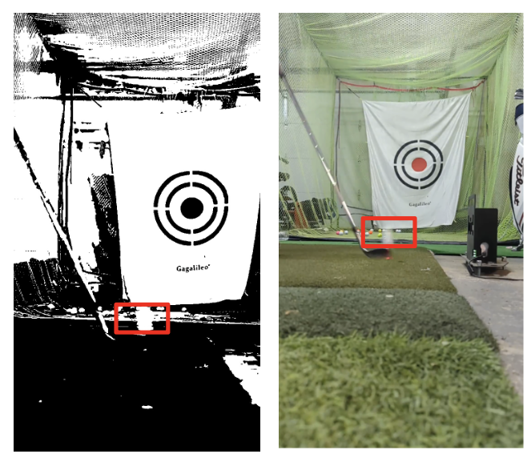
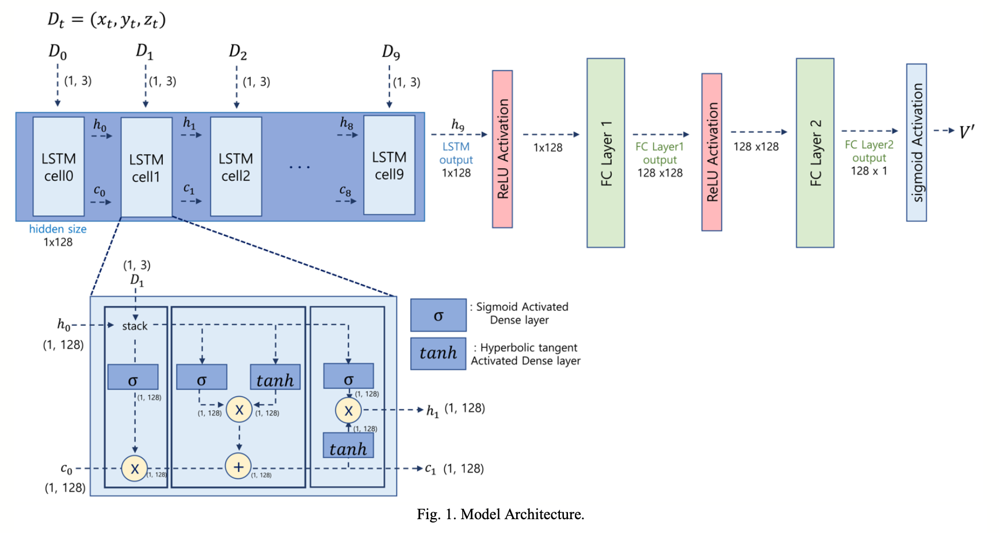
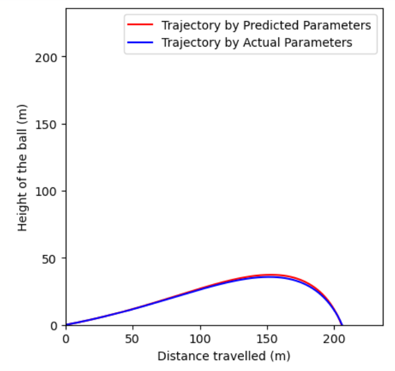

# 🏌️‍♂️Golf-Ball-Trajectory-Estimation
***시계열 데이터 기반 골프공 궤적 예측 모델 개발 프로젝트***

YOLOv8 모델을 통해 골프공의 초기 움직임을 포착하고, 

프레임 속 **골프공의 3차원 상의 위치(x, y, z) 만으로** 전체 골프공의 궤적을 예측하는 모델을 개발하였습니다. 

## 📚 기술 스택

  
  
  
  

## 🧑‍💻 학회지 등록

[ICTC 2023 논문](https://2023.ictc.org/program_proceeding)

## 📂Dataset: 

- Train dataset: 4,500
- Validation dataset: 500

- **데이터 생성 model:** Linear regression 

- Initial velocity(초기 공의 속도): 공이 뜨기 시작했을 때의 속도
- Spin rate(스핀량)
- Spin axis(스핀축)
- xz theta(x와 z 사이 각도): 공이 휘어진 각도

## 🚀Model: 
- Machine learning: linear regression
- LSTM model 

**궤적 예측 model:** LSTM 

**Output:**

| **전체 궤적** | **전체 궤적2** | 
| :------: |  :------: | 
|    xy축 기준 |    xz축 기준 | 

**Train Setup** >> 표로 전이 
- optimizer: adamW (eps: 1e-6)

- base learning_rate: 1e-3

- loss function: 

- epoch: 200

- batch size: 8

- augmentation: HorizontalFlip, shiftscalerotate

## 💯 Results

